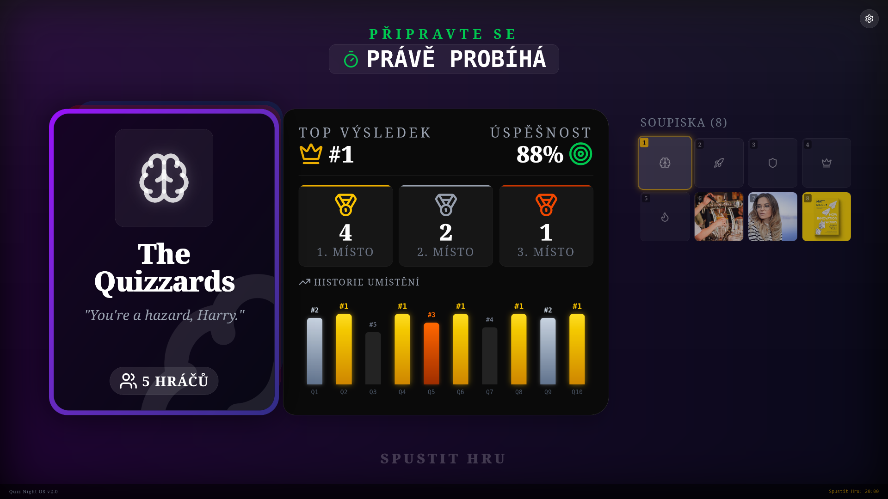
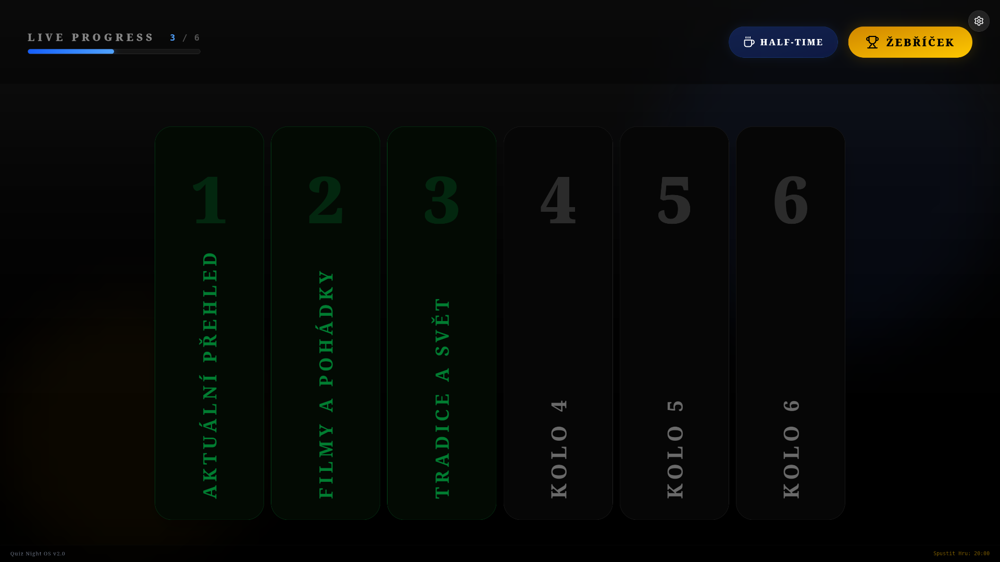
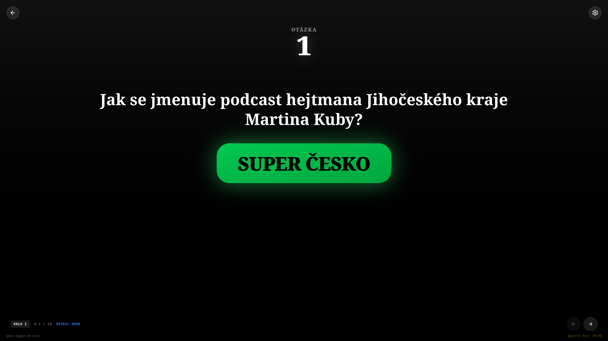
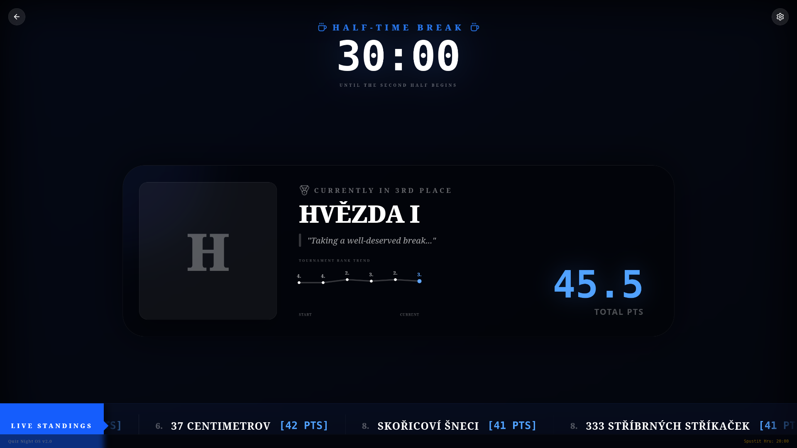
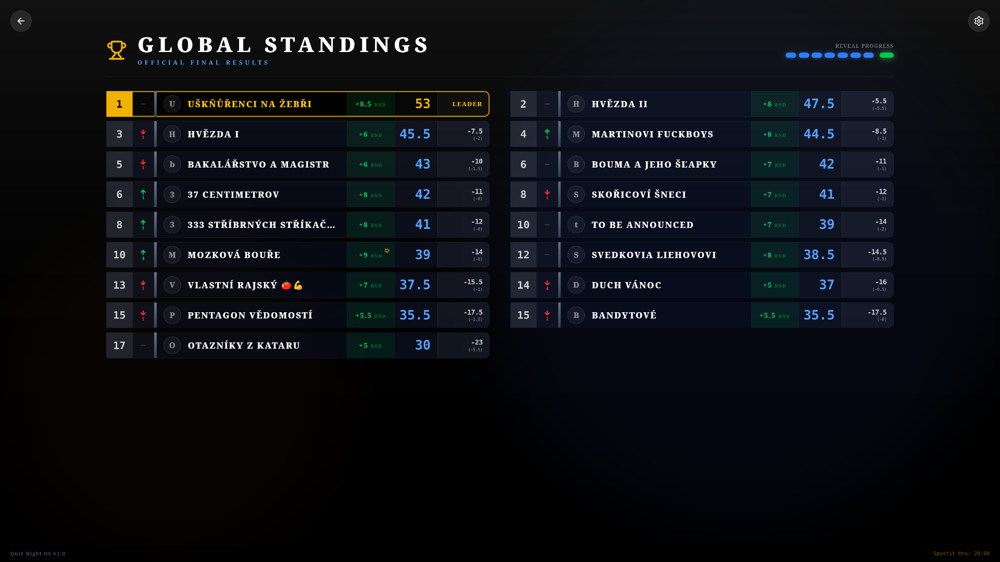

<div align="center">


</div>

# Quiz Night OS v2.0

A high-octane, TV-broadcast quality Pub Quiz Engine built with React. 

Quiz Night OS transforms a standard pub quiz into a professional game show experience. It features a dual-screen Master/Slave presenter system, real-time Google Sheets leaderboard syncing, F1-style live timing towers, and cinematic layout animations.

## ✨ Key Features

* **🎭 Dual-Screen Presenter Mode:** The app runs entirely in the browser. The Host opens a hidden control panel (`Shift + P`) that seamlessly syncs with the Main TV via the Broadcast Channel API. No backend websockets required!
* **📊 Live Google Sheets Sync:** Team scores are fetched live from a published Google Sheet CSV. It features cache-busting to ensure the data is always up-to-the-second.
* **🏎️ F1-Style Leaderboard:** A cinematic "Eurovision-style" reveal system. Standings hold their previous rank until the host reveals the round scores, culminating in a massive `framer-motion` layout shuffle.
* **🔥 Streak Mechanics:** Teams that score the maximum points in consecutive rounds trigger the "On Fire" UI, complete with animated CSS flames and glowing auras.
* **⏱️ Pressure Timer:** A Host-controlled countdown system (30s, 60s, 90s) with a dynamic progress bar that transitions from green, to yellow, to a flashing red warning.
* **🎬 Cinematic Half-Time:** A rotating glass-morphism spotlight that showcases team avatars, quotes, and a dynamic sparkline graph of their tournament rank history.

## 📸 Visual Preview

### Welcome Screen


### Rounds Dashboard


### Questions Screen


### Pause Screen


### Leaderboard Screen


## 🛠️ Tech Stack

* **Framework:** React 18 (via Vite)
* **Styling:** Tailwind CSS
* **Animations:** Framer Motion
* **Icons:** Lucide React
* **Data Parsing:** PapaParse (for local questions) & Custom Parsers (for Google Sheets)

## 🚀 Installation & Setup
1. **Clone the repository:**
   ```bash
   git clone <your-repo-url>
   cd quiz-night
   ```
2. **Install dependencies:**
    ```bash
    npm install
    ```
3. **Start the development server:**
    ```bash
    npm run dev
    ```

## 🎮 How to Run the Show
1. Connect your computer to the Main TV/Projector.
2. Open the app in your browser and drag the window to the TV. Make it fullscreen (`F11`).
3. On your primary laptop screen, press **`Shift + P`**.
4. A separate window will pop up. This is the **Host Dashboard**.
5. Use the Host Dashboard to control the flow of the game. The TV will automatically sync to your actions.
    
## 📂 Data Configuration

The app relies on three main data sources:
### 1. Game Content (`public/questions.csv`)
This file dictates the structure of the game (Rounds and Questions).
- Use the keyword `Kolo X - Title` in the first column to define a new round.
- Subsequent rows define questions. Supported types include `Written`, `Numeric`, `ABCD`, `Yes/No`, `PImage`, `PVideo`, and `Audio`.
- Media files referenced here should be placed in the `public/source/` directory.

### 2. Live Scores (Google Sheets)
In `src/App.jsx`, the app fetches a published Google Sheet CSV link.
- The sheet must contain a column named `Název týmu` (Team Name).
- Round score columns must contain the word `Kolo` (e.g., "Kolo 1", "Kolo 2").
- Total points should be in a column named `Počet bodů`.
- _Note: Ensure your Google Sheet is published to the web as a CSV._

### 3. Team Metadata (`src/data/teams.jsx`)
This file contains the visual identity for the teams competing.
- Match the `name` property exactly to the team names in your Google Sheet.
- You can configure `image`, `color` (Tailwind gradient classes), and a custom `quote` for the half-time spotlight.

## ⌨️ Global Shortcuts
- **`Shift + P`**: Opens the Presenter/Host window.
- **`Shift + D`**: Instantly returns the Main TV to the Dashboard.
- **`Arrow Right`**: Advance animation / Next Step.
- **`Arrow Left`**: Revert animation / Previous Step.
- **`Escape`**: Exit current screen and return to Dashboard.

## 🤝 License

MIT License. Created for the ultimate pub quiz experience.
