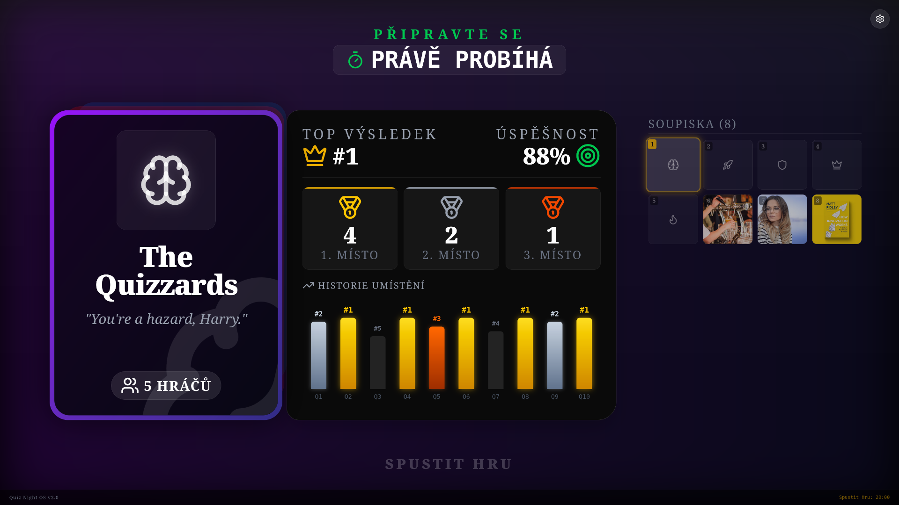
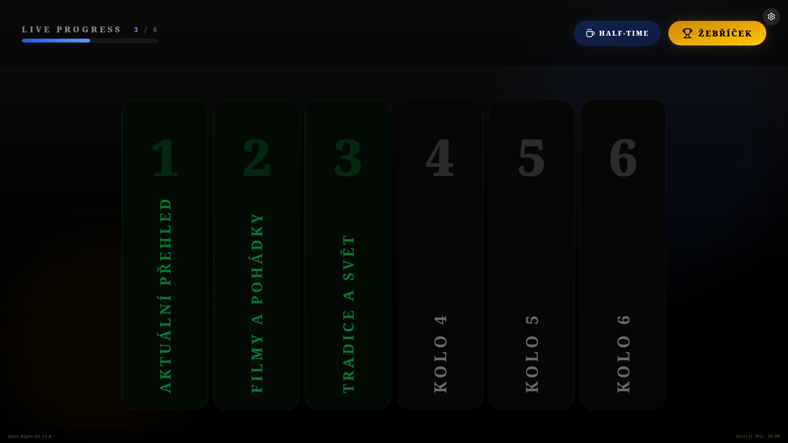
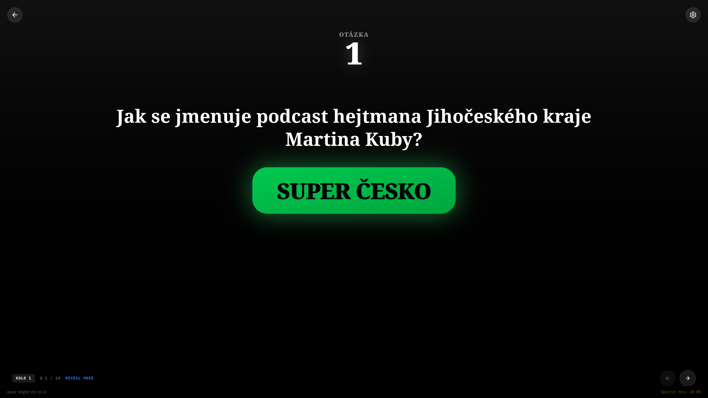
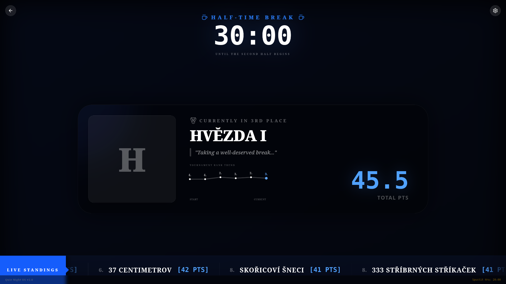
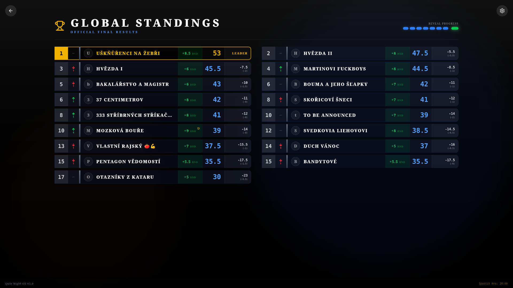

<div align="center">


</div>

# Quiz Night OS v2.0

Turn a pub quiz into a TV game show. Write the questions in a Google Sheet, add your pictures and teams, and run the show from your laptop: the TV shows the questions and the leaderboard, while a second window gives the host the answers and the controls.

**Use it in the browser: https://jakub-kos.github.io/QuizNightWebApp/**. Nothing to install and no account: your quizzes are stored in your own browser (Chrome or Edge recommended). The full guide is under **Help** in the app, in English, Czech and Hungarian.

## ✨ Features

* **📚 Your own quizzes:** create as many quizzes as you like, or open the built-in demo. Export a quiz as one `.zip` (questions, pictures, teams, scores) to back it up or hand it to a friend, who imports it on their computer.
* **📝 Questions from Google Sheets:** paste a Sheet link and the questions load from it; reload after every edit. A ready-made template is linked from Help → Templates.
* **❓ Question types:** written, numeric, ABCD, yes/no, image, audio, video, picture or video first, Top 5, and put-in-order (Sort, with text or pictures).
* **✅ Quiz check:** before the show, see every question as it will look on the TV, with a list of problems such as missing pictures, wrong answers for ABCD, or Sort letters that don't add up.
* **🎭 Two windows, one show:** the TV window and the host window (`Shift + P`) stay in sync in the same browser, without any server.
* **👥 Teams:** names, number of players, photos and mottos; load the names straight from the scores Sheet. A welcome screen introduces every team: big cards for teams with photos and history, or a team wall when you only know the names.
* **📋 Attendance:** at the start, tick off who came and place each team on a seating map, so the host knows which way to face when announcing results.
* **📊 Scores:** from a Google Sheet that fills in live, or typed into the app's own score table.
* **🏎️ Leaderboard reveal:** rankings hold until the host reveals the round's points group by group, then everything reshuffles. Teams with the best round twice in a row are "on fire".
* **📜 Rules, prizes, half-time:** editable rules and prizes screens, and a half-time screen with a countdown and the teams' standings.
* **🖥️ Fits any screen:** the show is drawn on a fixed canvas scaled to the window; `Shift + C` adjusts the size and margins for TVs that cut the edges.

## 📸 Visual Preview

### Welcome Screen


### Rounds Dashboard


### Questions Screen


### Pause Screen


### Leaderboard Screen


## 🚀 Preparing a quiz

1. Open the app and click **New quiz**.
2. **Questions:** copy the Google Sheet template (Help → Templates), fill it in, share it as "anyone with the link can view" and paste the link. You can also upload a `.csv` instead. Help → Question types shows, for every type, the exact rows to write and what they look like on screen.
3. **Media:** drag your pictures, audio and video in (a whole folder works). File names must match the `Zdroj` column of the sheet.
4. **Live scores** (optional): paste the link of the scores Sheet. Without one, type the points into the app during the show.
5. **Teams:** add them by hand, import a CSV, or load the names from the scores Sheet.
6. **Rules and prizes:** keep the default rules or write your own.
7. Click **Check** and fix what it reports.

## 🎮 Running the show

1. Connect the laptop to the TV or projector and open the quiz with **Start show**. Drag the window to the TV and press `F11`.
2. Press **`Shift + P`** for the host window and keep it on the laptop screen.
3. Run everything from the host window: it shows the answers, the next step and the timer, and the TV follows. During the quiz it also has **Attendance** and **Scores** buttons.

## ⌨️ Shortcuts

- **`Shift + P`**: open the host window
- **`Shift + D`**: back to the rounds dashboard
- **`Shift + C`**: adjust the picture size for the TV
- **`→` / `←`**: next / previous step
- **`Z`**: enlarge the question's picture
- **`Esc`**: close the picture, or leave the current screen

## 🛠️ For developers

React 19 + Vite, Tailwind CSS v4, Framer Motion, Lucide icons, PapaParse and fflate. There is no backend: quizzes and media live in IndexedDB, the windows talk over BroadcastChannel, and Google Sheets are read as CSV.

```bash
git clone git@github.com:Jakub-Kos/QuizNightWebApp.git
cd QuizNightWebApp
npm install
npm run dev     # development server
npm run lint    # ESLint
npm run build   # production build in dist/
```

Every push to `main` deploys to GitHub Pages.

## 🤝 License

MIT License. Created for the ultimate pub quiz experience.
