<div align="center">

# Quiz Night OS

**Turn your pub quiz into a TV game show.**

Write the questions in a Google Sheet, drop in your pictures and teams, and run the whole night from your laptop:<br>
the TV shows the show, a second window gives the host the answers and the controls.

### [▶ Open the app](https://jakub-kos.github.io/QuizNightWebApp/)

Free, nothing to install, no account. Your quizzes stay in your own browser.


<br>

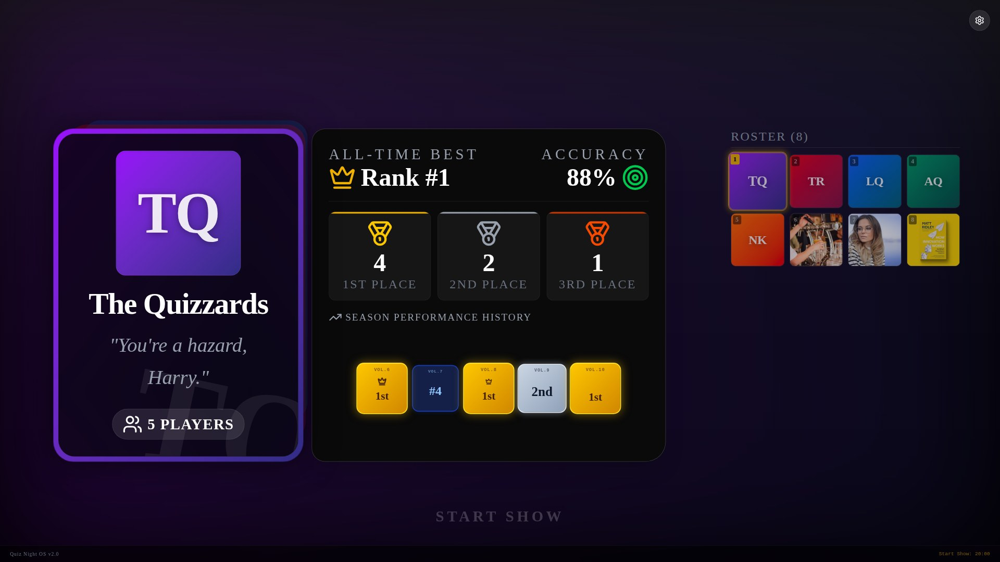

</div>

## How a quiz night looks

<table>
  <tr>
    <td width="50%">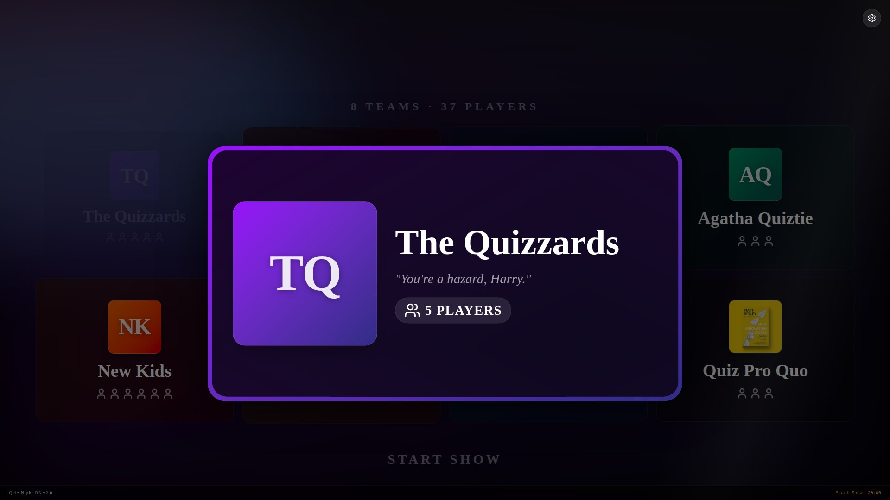<br><b>Every team gets an introduction.</b> Teams with photos and history get big cards; teams known only by name get a living team wall.</td>
    <td width="50%">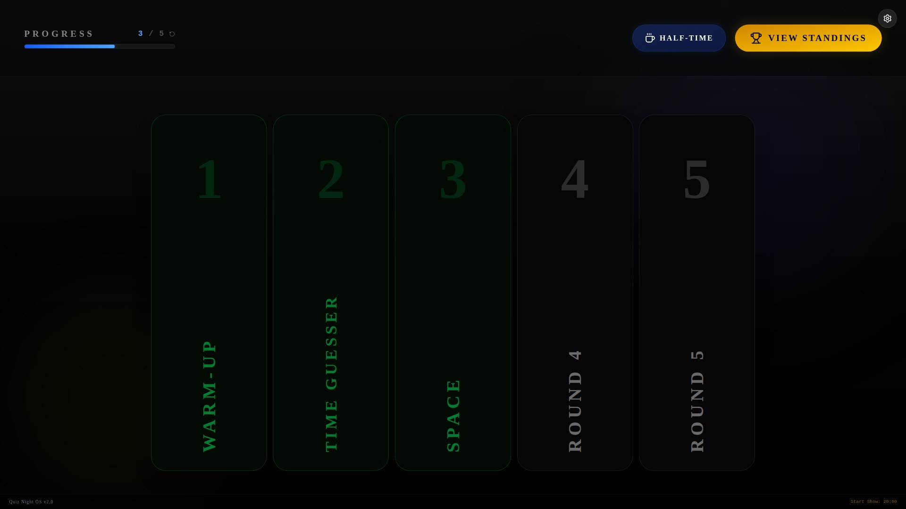<br><b>The rounds at a glance.</b> Finished rounds reveal their names, the bar shows how far the night is.</td>
  </tr>
  <tr>
    <td>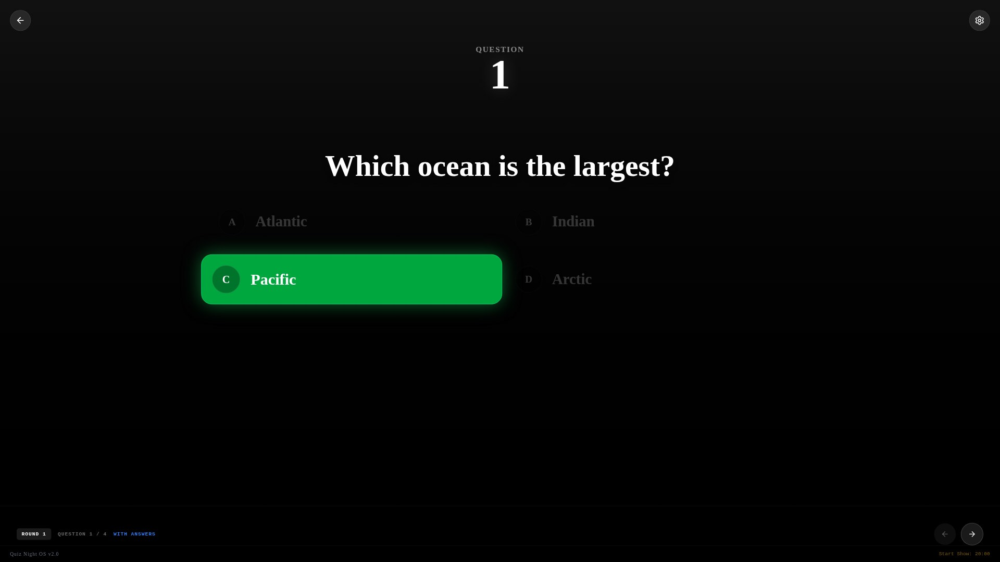<br><b>Questions, then answers.</b> Play a round with answers, or questions only with a timer and reveal them later.</td>
    <td>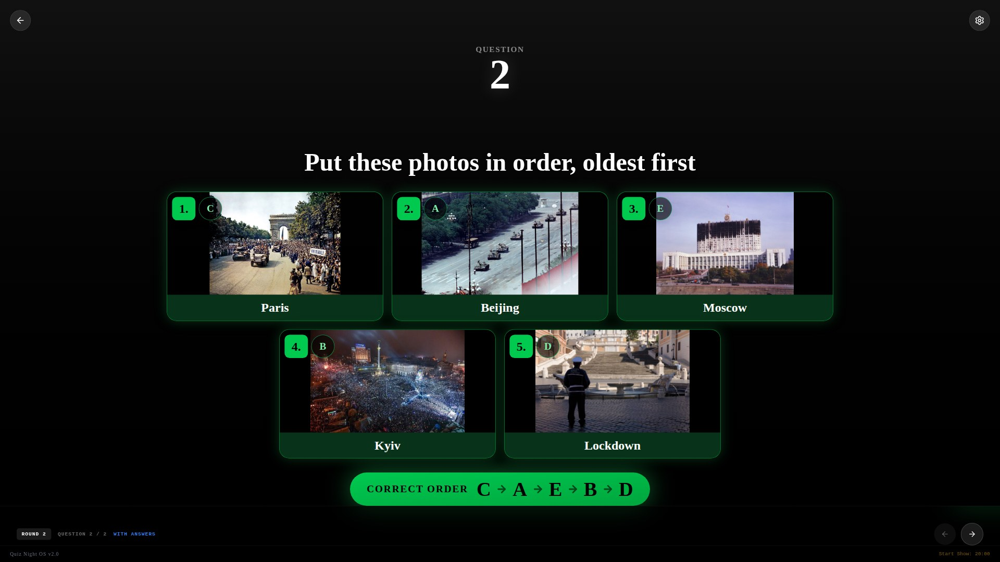<br><b>Eleven question types</b>, from ABCD and Top 5 to pictures, audio, video and putting things in order.</td>
  </tr>
  <tr>
    <td>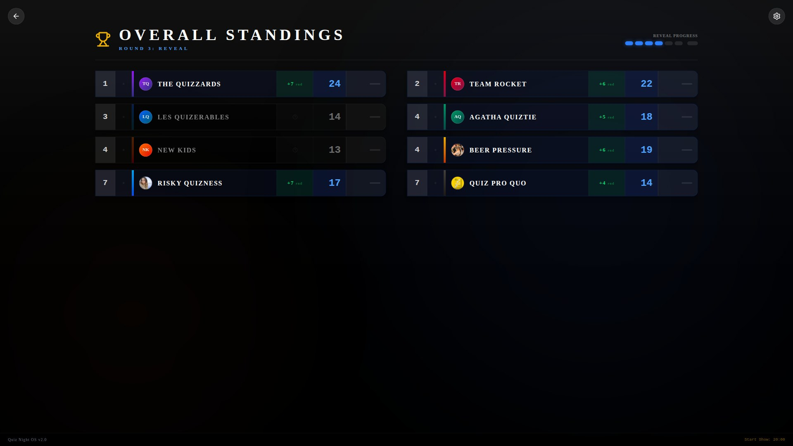<br><b>A real reveal.</b> The standings hold until the host reveals the round's points group by group, from the lowest score up.</td>
    <td>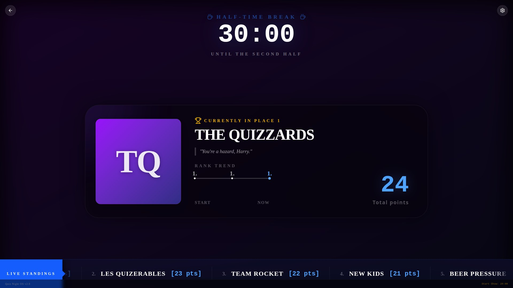<br><b>Half-time</b> with a countdown, the teams in the spotlight and the live standings ticker.</td>
  </tr>
</table>

<details>
<summary><b>More screens:</b> rules, prizes, picture and Top 5 questions</summary>
<br>
<table>
  <tr>
    <td width="50%">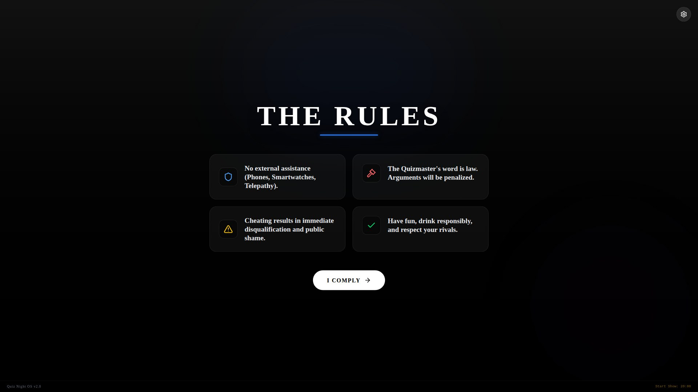</td>
    <td width="50%">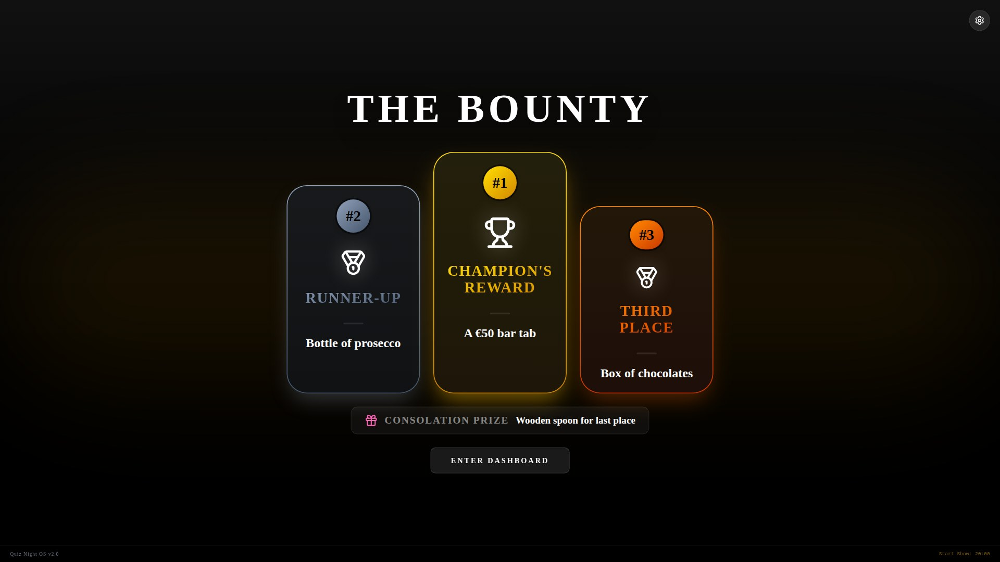</td>
  </tr>
  <tr>
    <td>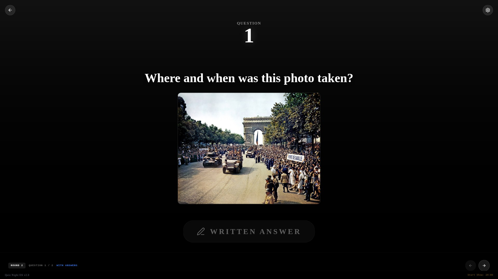</td>
    <td>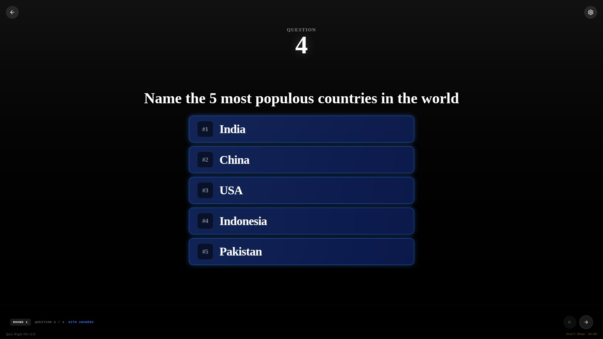</td>
  </tr>
</table>
</details>

## What the host sees

Press `Shift + P` and a second window opens on the laptop. It runs the show: the TV follows every click, with no server in between.

<table>
  <tr>
    <td width="50%">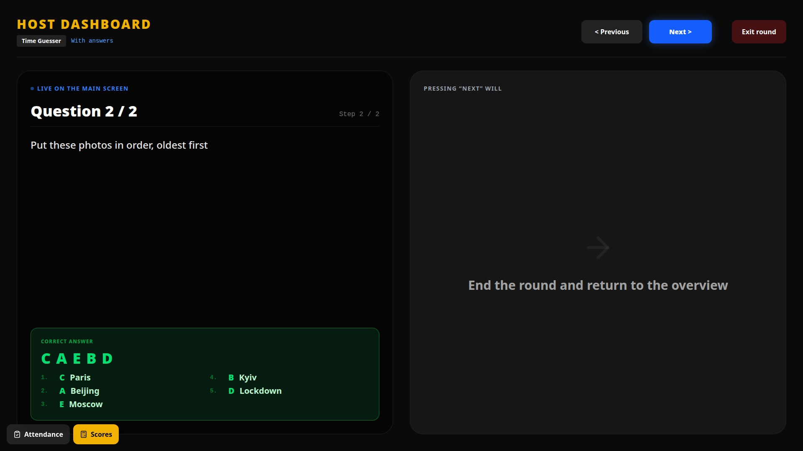<br><b>The answer before anyone else.</b> The current question, the correct answer and what the next click will do.</td>
    <td width="50%">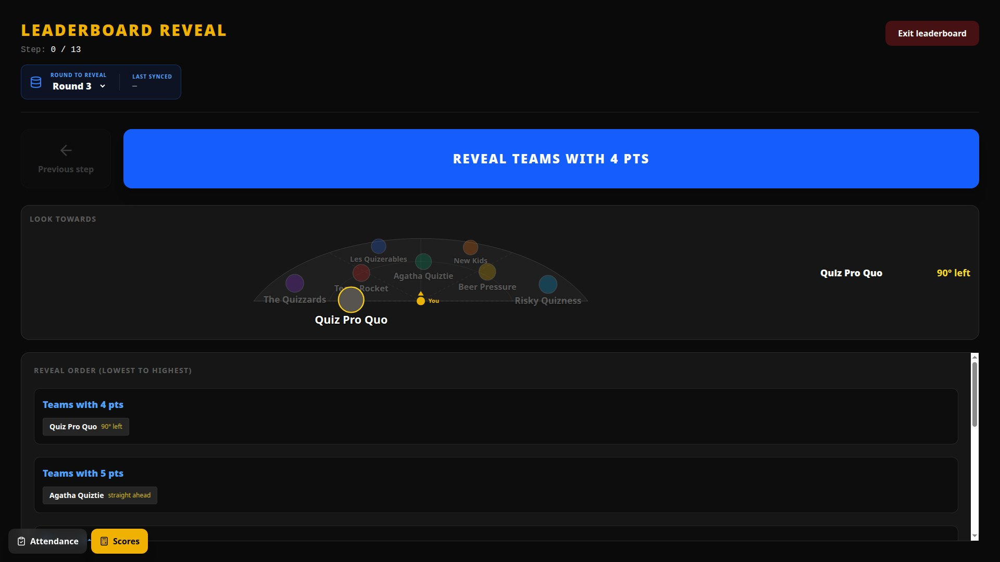<br><b>Which way to look.</b> During the reveal the seating map shows where the announced teams sit.</td>
  </tr>
  <tr>
    <td>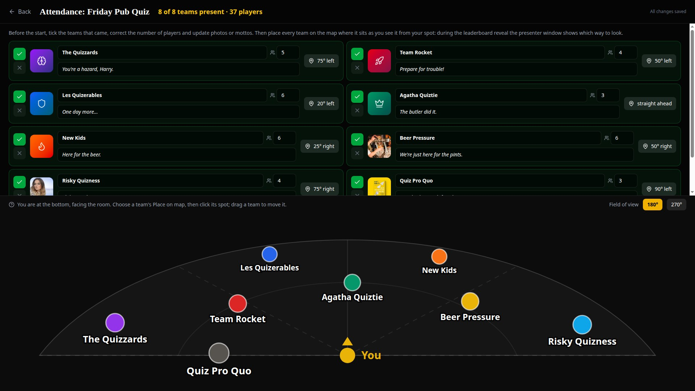<br><b>Attendance.</b> Tick off who came, fix the number of players, and place each team on the map of the room.</td>
    <td>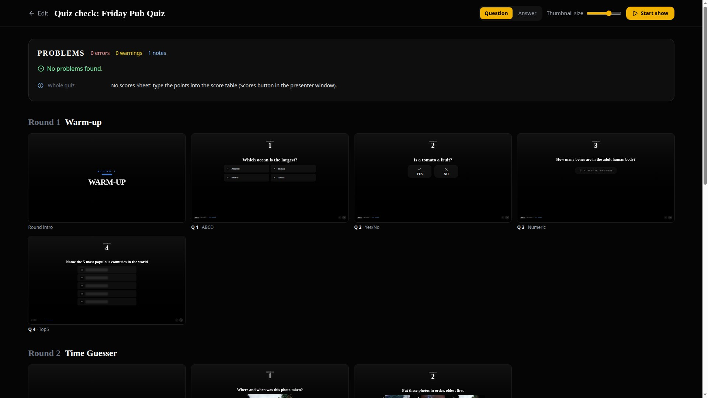<br><b>Check before the show.</b> Every question as the TV will show it, plus a list of what is missing or wrong.</td>
  </tr>
</table>

## Make your own quiz

<table>
  <tr>
    <td width="33%">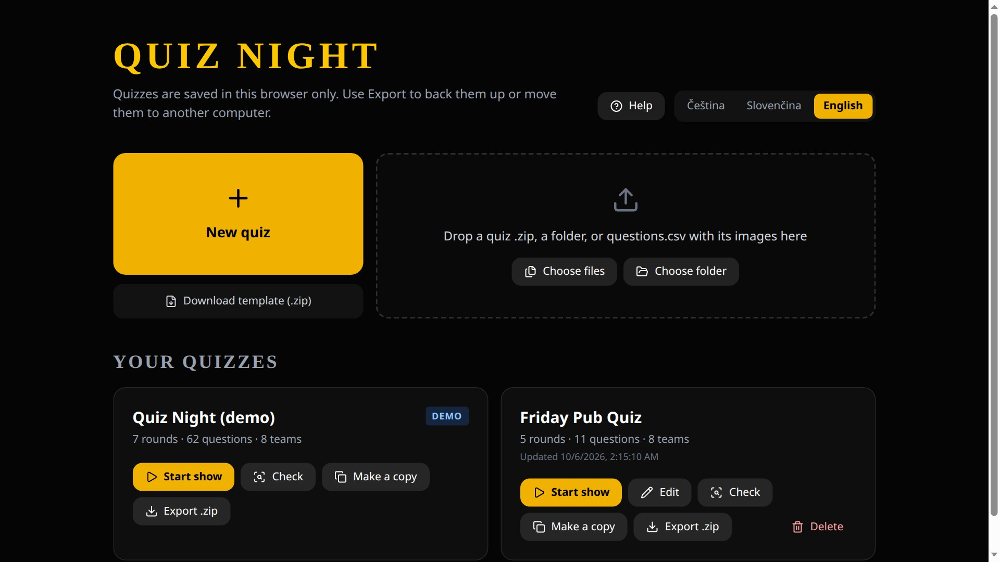</td>
    <td width="33%">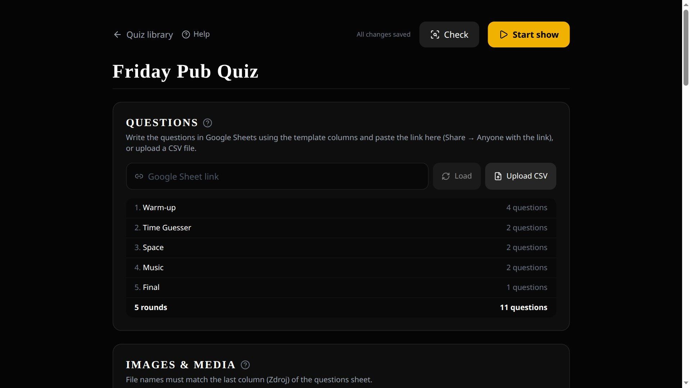</td>
    <td width="33%">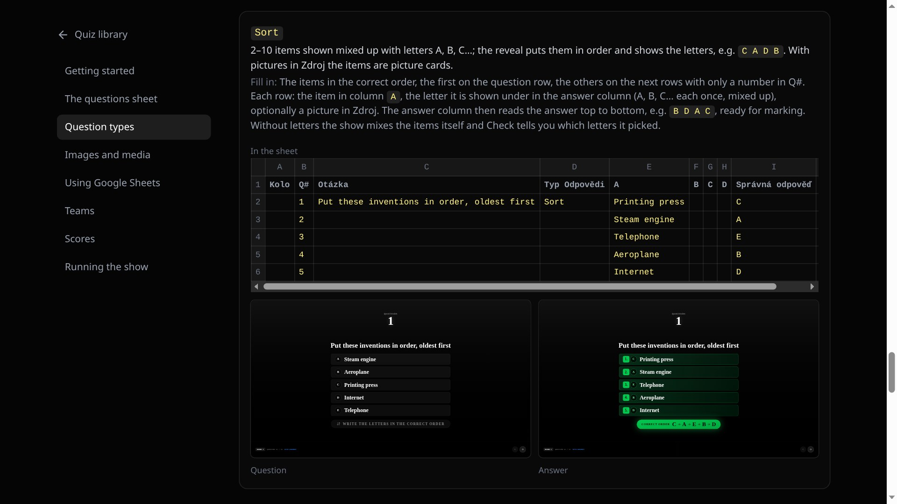</td>
  </tr>
</table>

1. **Open the [app](https://jakub-kos.github.io/QuizNightWebApp/)** and click **New quiz**, or start from the built-in demo.
2. **Questions:** copy the Google Sheet template (Help → Templates), fill it in, share it as *anyone with the link can view* and paste the link. Help → Question types shows the exact rows for every type and what they look like on screen.
3. **Media:** drag in your pictures, audio and video. A whole folder works.
4. **Scores:** paste the link of your scores Sheet, or type the points into the app during the show.
5. **Teams:** type them in, import a CSV, or load the names from the scores Sheet.
6. **Check**, fix what it finds, and **Start show**.

Export a quiz as one `.zip` to back it up or move it to the laptop you will use on the night.

## On the night

1. Connect the laptop to the TV, open the quiz with **Start show**, drag the window to the TV and press `F11`.
2. Press `Shift + P` and keep the host window on the laptop.
3. If the TV cuts off the edges, press `Shift + C` on the TV window to shrink the picture.

| Key | Does |
| --- | --- |
| `Shift + P` | Open the host window |
| `→` / `←` | Next / previous step |
| `Z` | Enlarge the question's picture |
| `Esc` | Close the picture, or leave the current screen |
| `Shift + D` | Jump back to the rounds dashboard |
| `Shift + C` | Adjust the picture size for the TV |

The app is in **English, Czech and Hungarian**. It works best in Chrome or Edge.

## For developers

React 19 + Vite, Tailwind CSS v4, Framer Motion, Lucide icons, PapaParse and fflate. There is no backend: quizzes and media live in IndexedDB, the two windows talk over `BroadcastChannel`, and Google Sheets are read as CSV.

```bash
git clone git@github.com:Jakub-Kos/QuizNightWebApp.git
cd QuizNightWebApp
npm install
npm run dev     # development server
npm run lint    # ESLint
npm run build   # production build in dist/
```

Every push to `main` deploys to GitHub Pages.

## License

MIT
